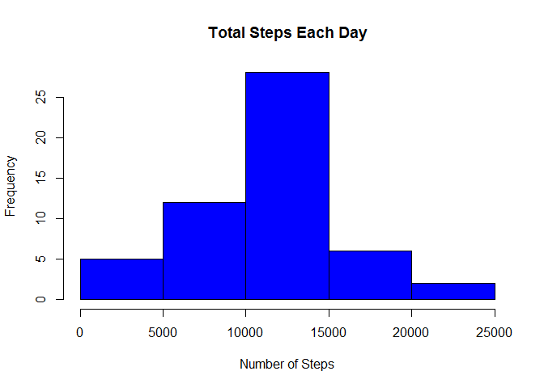

# Analyzing FitBit Data
Anthony Rosati  
August, 2015  
###About
This is the first project for the **Reproducible Research** course in Coursera's Data Science specialization track. The purpose of this project is to answer, in a Reproducible and [Literate Programming](https://en.wikipedia.org/wiki/Literate_programming) manner, a series of questions using data collected from a personal activity monitoring device similar to a [FitBit](http://en.wikipedia.org/wiki/Fitbit).


## Synopsis
The purpose of this project is to practice:

* loading and preprocessing data
* imputing missing values
* interpreting data to answer research questions
* generate a reproducible work package (i.e., this markdown file)

## Data Specifics
The data for this assignment is downloaded from the course web site:

* Dataset: [Activity monitoring data](https://d396qusza40orc.cloudfront.net/repdata%2Fdata%2Factivity.zip) [52K]

The variables included in this dataset are:

* **steps**: Number of steps taking in a 5-minute interval (missing values are coded as `NA`).

* **date**: The date on which the measurement was taken in YYYY-MM-DD format.

* **interval**: Identifier for the 5-minute interval in which the measurement was taken.

The dataset is stored in a comma-separated-value (CSV) file and there are a total of 17,568 observations in this dataset.

## Loading and preprocessing the data

We downloaded, unzipped and loaded the data into a data frame called `data`. 

```r
if(!file.exists("repdata%2Fdata%2Factivity.zip")) {
        temp <- tempfile()
        download.file("http://d396qusza40orc.cloudfront.net/repdata%2Fdata%2Factivity.zip",temp)
        unzip(temp)
        unlink(temp)
}

data <- read.csv("activity.csv")
```


## What is mean total number of steps taken per day?
We aggregated steps by day, created a Histogram, and calculated the mean and median...

```r
steps_by_day <- aggregate(steps ~ date, data, sum)
hist(steps_by_day$steps, main = paste("Total Steps Each Day"), col="blue", xlab="Number of Steps")
```

 

```r
rmean <- mean(steps_by_day$steps)
rmedian <- median(steps_by_day$steps)
```

The `mean` was found to be 10766.19 and the `median` was found to be 10765.

## What is the average daily activity pattern?

* We calculated average steps for each interval for all days. 
* We plotted the Average Number Steps per Day by Interval. 
* We determined the interval with most average steps. 

```r
steps_by_interval <- aggregate(steps ~ interval, data, mean)

plot(steps_by_interval$interval, steps_by_interval$steps, 
     type="l", xlab="Interval", ylab="Number of Steps", 
     main="Average Number of Steps per Day by Interval")
```

 

```r
max_interval <- steps_by_interval[which.max(steps_by_interval$steps),1]
```

The 5-minute interval, on average across all the days in the data set, containing the maximum number of steps is 835.

## Imputing missing values, and comparing imputed to non-imputed data.
Missing data needed to be imputed. Only a simple imputation approach was required for this assignment. 
So, our strategy was to imput missing values by inserting the average for each interval. Thus, if interval 10 was missing on 10-02-2012, the average for that interval for all days (i.e., 0.1320755), replaced the NA. 

```r
incomplete <- sum(!complete.cases(data))
imputed_data <- transform(data, steps = ifelse(is.na(data$steps), steps_by_interval$steps[match(data$interval, steps_by_interval$interval)], data$steps))
```

We imputed zeros for 10-01-2012 because it is the first day and would have been over 9,000 steps higher than the following day, having only 126 steps. NA's were then assumed to be zeros to fit the rising trend of the data. 

```r
imputed_data[as.character(imputed_data$date) == "2012-10-01", 1] <- 0
```

Let's recount the total steps by day using this imputation data and create a new Histogram (showing any differences from the original one)... 

```r
steps_by_day_i <- aggregate(steps ~ date, imputed_data, sum)
hist(steps_by_day_i$steps, main = paste("Total Steps Each Day"), col="blue", xlab="Number of Steps")

#Create a Histogram to show the differences. 
hist(steps_by_day$steps, 
     main = paste("Total Steps Each Day"), 
     col="red", xlab="Number of Steps", add=T)
legend("topright", c("Imputed", "Non-imputed"), col=c("blue", "red"), lwd=10)
```

 

We now calculate the new mean and median for the updated data with imputation... 

```r
rmean.i <- mean(steps_by_day_i$steps)
rmedian.i <- median(steps_by_day_i$steps)
```

Let's calculate difference in the means and medians between imputed and non-imputed data.

```r
mean_diff <- rmean.i - rmean
med_diff <- rmedian.i - rmedian
```

Let's also calculate the total difference in steps between the actual data and the data with imputed values...

```r
total_diff <- sum(steps_by_day_i$steps) - sum(steps_by_day$steps)
```
* The imputed data mean is 10589.69
* The imputed data median is 10766.19
* The difference between the non-imputed mean and imputed mean is -176.49
* The difference between the non-imputed mean and imputed mean is 1.19
* The difference between total number of steps between imputed and non-imputed data is 7.5363321\times 10^{4} (meaning there are 75363.32 more steps in the imputed data).


## Are there differences in activity patterns between weekdays and weekends?
We created a plot to compare and contrast the number of steps between the weekdays and the weekend. A higher peak was noticed to occur earlier on weekdays, and more overall activity on weekends was noted.  

```r
weekdays <- c("Monday", "Tuesday", "Wednesday", "Thursday", "Friday")
imputed_data$dow = as.factor(ifelse(is.element(weekdays(as.Date(imputed_data$date)),weekdays), "Weekday", "Weekend"))

steps_by_interval_i <- aggregate(steps ~ interval + dow, imputed_data, mean)

library(lattice)
```

```
## Warning: package 'lattice' was built under R version 3.1.3
```

```r
xyplot(steps_by_interval_i$steps ~ steps_by_interval_i$interval|steps_by_interval_i$dow, 
       main="Average Steps per Day by Interval", xlab="Interval", ylab="Steps", layout=c(1,2), type="l")
```

 
